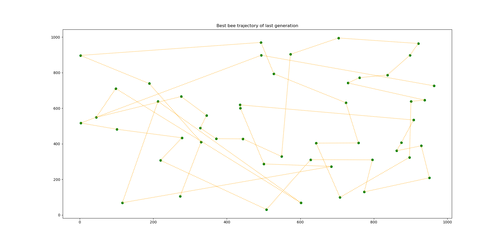

# Miel et abeilles
## Algorithme de génétique

### Selection
Plusieurs méthodes de séléction d'individus à reproduire ont été testées:
- Méthode aléatoire :
- Méthode classement :
- Méthode tournoi : 
- Méthode Battle Royale :

### Reproduction
La reproduction des abeilles a été faite comme suit :

### Mutation

### Evolution

