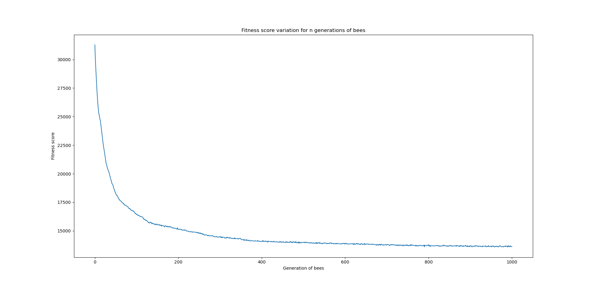

# Miel et abeilles : algorithme de génétique

### Score d'adaptation(fitness)
La performance d'une abeille est évaluée par son score d'adapation. Le score d'une abeille est défini comme la norme $`L_1`$.

$`|F_2 - F_1| = |x_2-x_1|+|y_2-y_1|`$

Ce score représente la distance parcouru par une abeille d'une fleur à l'autre. Il devra donc être minimisée.

### Sélection
Plusieurs méthodes de sélection d'individus à reproduire ont été testées:
- Méthode aléatoire : tirage aléatoire de 40 abeilles. Une moitié pour être les pseudo meilleures abeilles et l'autre moitié pour être les pseudo pires.
- Méthode classement : les 20 abeilles avec le meilleur score d'adaptation vont se reproduire, les 20 abeilles avec le pire score d'adaptation seront bannis de la ruche.
- Méthode tournoi : les abeilles sont tirées aléatoirement de la ruche par pairs de deux. Pour chaque couple, la meilleure des deux pourra se reproduire, l'autre sera bannie.
- Méthode Battle Royale : un tirage de 20 groupes de 5 abeilles est effectué. L'abeille la plus performante d'un groupe est sélectionnée se reproduire. La pire abeille sera bannie.

### Reproduction
La reproduction des abeilles a été faite comme suit :
- Enfant 1 : 50% du génome de parent 1 + 50% du génome de parent 2.
- Enfant 2 : 50% du génome de parent 2 + 50% du génome de parent 1.

### Mutation
Une altération aléatoire du génome des enfants est appliquée. Une séquence de 5 fleurs du génome est mélangée.

### Evolution

Il est possible d'observer l'évolution des scores d'adaptation des abeilles au fil des générations. Lorsque les performances stagnent, une mutation doit apparaître.

Les figures ci-dessous montrent les résultats d'évolution de 1000 générations d'abeilles pour une sélection par classement.

